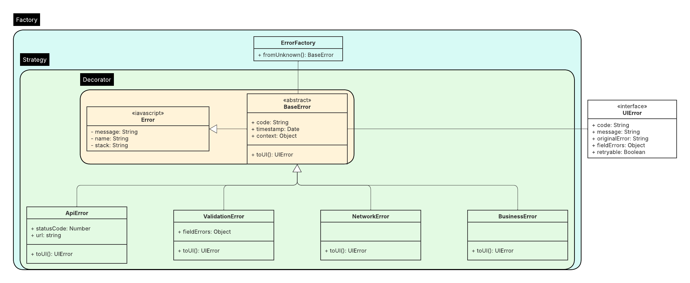
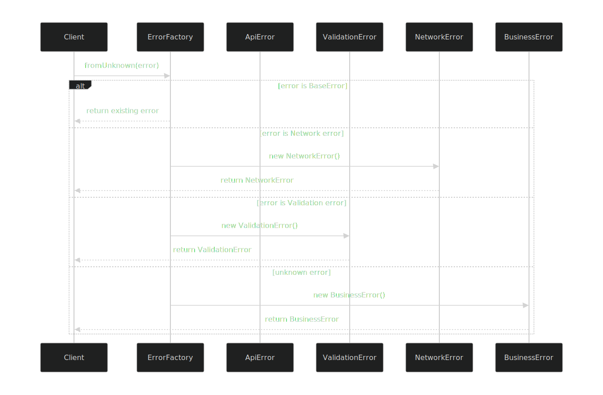
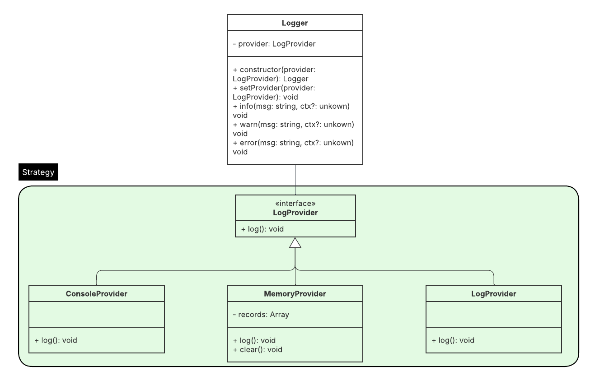
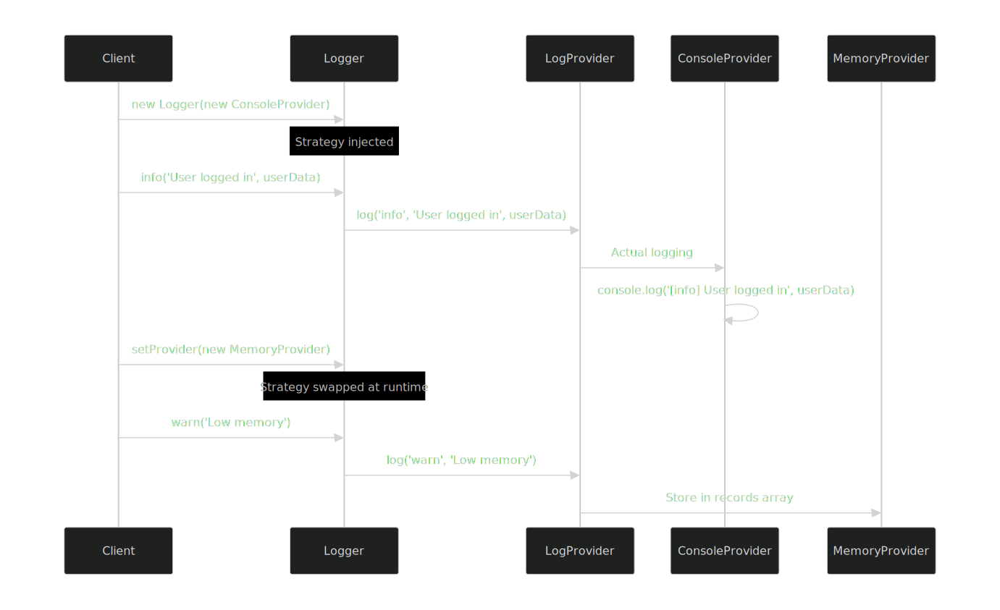

# 20MinCoach
Diseño de Software / IC-6821
  
## Group Members:
- Daniel Pulido
- Ian Porras
- Carlos Ávalos

# Project Architecture Documentation

## 0. Executive Summary

This repository contains the front-end architecture design, PoCs and implementation documentation for the 20MinCoach project. Here is a summarized list of the components used for this design:

- **Auth (PoC):** Uses `Supabase` (OTP email) + `TOTP MFA` flows integrated with expo. Supabase is Expo-friendly; replaces Auth0 MFA without the need for custom native configurations, satisfying the authentication requirements for this project.
- **Roles:** From `raw_app_meta_data.roles` 2 roles were defined: BasicUser, PremiumUser.
  - **Action A:** ("Start 20-min request") Basic & Premium.
  - **Action B:** ("View earnings") Premium only. 
- **UI Security:** RequireAuth, RequireRole and RoleGate (component/action-level gates) Dashboards use these guards.
- **HTTP Interceptor:** Injects bearer token; on 401 → sign-out, clear Redux, redirect `/auth`. "Force 401" button added to both dashboards for verification.
- **State & Data plumbing:**
  - **Redux Toolkit:** Slice auth ({email, roles}).
  - **TanStack Query provider:** Retries, cache, refetch on focus.
  - **httpJson helper:** timeout + safe JSON parse (layered on the interceptor).
- **Verification Page:** tools/data-test (inputs in blue for dark mode), uses TanStack Query + httpJson.

## 1. Technology Choices
- **Framework/Navigation:** `React Native`, `Expo`, `expo-router`
  - **React Native:** Enables a single codebase for iOS and Android, providing great cross-platform efficiency.
  - **Expo:** Expo provides an all-in-one environment with minimal native setup, as well as over-the-air updates and easy builds with EAS.
  - **expo-router:**  Simplifies navigation by mapping files to routes automatically, improving maintainability.
  - **Expo Go:** Allows fast testing without the need for custom native modules.
- **Authentication:** `Supabase` (`@supabase/supabase-js`) with `Email OTP` + `TOTP MFA`, secure storage via `expo-secure-store`  
  - **Supabase:** Provides hosted auth and database, reducing backend complexity. Provides an extra security layer to protect user accounts by using TOTP MFA. Enables modern, passwordless login; email OTP steamlines onboarding and improves UX.
  - `@supabase/supabase-js`: JS SDK that works seamlessly in React Native and Expo environments.
  - `expo-secure-store`:  Ensures tokens and secrets are stored encrypted on the device.
- **State Management:** `Redux Toolkit` (global app state), `TanStack Query` (remote server data)
  - **Redux Toolkit:** Holds app logic and provides centralized management for authentication, navigation guards and UI flags. Simplifies setup and enforces best practices.
  - **TanStack Query:** Manages network data, handles caching, retries, background refetching, and synchronization with server state.
- **Networking:** Native `fetch` wrapped by `withAuth` interceptor + `httpJson` utility. 
  - `withAuth`: Adds auth headers and handles token refresh logic in one place.
  - `httpJson`: Adds timeouts and automatic JSON parsing to reduce repetitive code.
 This provides a consistent API layer that ensures all network calls follow the same structure and error handling. Also keeps dependencies minimal while adding key functionality (auth, parsing, retries).
- **Middleware & Security in UI:** Custom guards and interceptors in `/src/middleware`. This will keep UI components clean by abstracting access control and network handling. 
  - `auth.guard.ts`: To ensure only authorized users with correct roles can access certain screens. This will check user roles and redirect unauthorized users.
  - `http.interceptor.ts`: Injects tokens into outgoing requests and handles 401 Unauthorized responses gracefully.
- **Prototype with AI + UX Testing:** `Lovable`, integrated with `Maze`
  - `Lovable`: Generates prototype screens consistent with UI components.
  - `Maze`: Allows for UX validation before implementation. Refine UI/UX based on real user interactions.
- **Services, Listeners & Simulations:** Mock simulations, `SSE` (EventSource), `expo-notifications`, `Daily Prebuilt` via `react-native-view`, `/src/services/realtime.ts`
  - `Daily Prebuilt`: Simulated sessions with basic controls using mock URL.
  - `SSE` & `setInterval`: Mocks to emit events (coach availability, acceptance).
  - `/src/services/realtime.ts`: exposes `subscribePresence()` and `subscribeSession()` for consuming events.
  - `expo-notifications`: Registers the device and displays local pushes based on simulations.
- **Business Models & Validation:** `/src/models`, `DTOs`, `Zod` schemas
  - `/src/models`: Define entities that will be used by the application.
  - `/src/services/dto.ts`: Maps API responses to internal models for data transformations.
  - `Zod`: Ensures data integrity with schemas and helps generate validators for new entities.
- **Error Handling & Logging:** `/src/middleware/error.middleware.ts`, `/src/utils/logger.ts`
  - `/src/utils/logger.ts`: Implements **Strategy Pattern** to switch between console output and future remote logging. All layers (services, UI, middleware) use the logger to ensure consistent debugger and traceability. Provides a single point of control for log formatting.
  - `/src/middleware/error.middleware.ts`: Maps API and logic errors to user-friendly UI messages, provides a single point of control for error formatting.
- **Styling:** React Native primitives with custom color scheme (blue inputs/text for dark mode). This avoids extra dependencies, while allowing for high-contrast colors to ensure readability and compliance with accessibility standards. Provides a centralized color palette that promotes uniform design across components.
- **Testing:** `Jest` + `React Testing Library`
  - `Jest`: Provides fats, isolated tests for logic and components. Integrates well with Expo-managed projects.
  - `React Testing Library`: Testing from user's perspective.
Automated tests will catch regressions early in CI/CD.

## 2. N-Layer Architecture Design

---

### 1. Presentation Layer (UI)
**Location:** `/src/components`, `/src/screens`, `/src/navigation`
- Displays data and collects user input.
- No business logic; delegates to state or services.
- Example: `CoachListScreen.tsx` calls `useCoachesQuery()` and renders list.

---

### 2. State Management Layer
**Location:** `/src/store`, `/src/hooks`, `/src/query`
- Manages global state (Redux Toolkit) and remote data (TanStack Query).
- Provides custom hooks for UI consumption.
- Example: `authSlice.ts`, `useCoachesQuery()`.

---

### 3. Domain Layer (Business Models)
**Location:** `/src/models`
- Pure business entities and rules: `User`, `Coach`, `Session`, `Role`.
- No networking, no middleware.
- Example: `Coach` class with domain logic (e.g., eligibility checks).

---

### 4. Validation & Transformation Layer
**Location:** `/src/validators`, `/src/services/dto.ts`
- DTOs: transform API responses to domain models and vice versa.
- Validators (Zod schemas) ensure correct data before entering domain layer.
- Example: `CoachSchema` validates incoming data; `dto.ts` maps `{ first_name } → { firstName }`.

---

### 5. Service / Application Layer
**Location:** `/src/services`
- Orchestrates domain models and infrastructure (API/networking) for the UI.
- Contains business workflows.
- Example:
  - `coachService.ts`: calls HTTP, applies DTOs, returns domain objects.
  - Can use **service-specific middleware** like `auth.guard.ts` to enforce rules at service boundaries.

---

### 6. Infrastructure Layer
**Location:** `/src/utils`, `/src/config`, `/src/middleware`, `/src/lib`
- Technical support (purely non-business): HTTP wrappers, logging, storage, error handling.
- Middleware like `http.interceptor.ts` lives here because it’s **technical, not business**.
- Example:
  - `httpJson.ts`: fetch wrapper with timeout and JSON parsing.
  - `logger.ts`: Strategy pattern logging.
  - `error.middleware.ts`: maps errors to messages.

---

### 7. Cross-Cutting Concerns
- **Logging:** via `logger.ts`
- **Error Handling:** via `error.middleware.ts`
- **Security:** route guards (`auth.guard.ts` in services layer), token storage.
- **Configuration:** environment variables and constants in `/src/config`.

---

## 3. Visual Components Strategy

### 1. Component Organization Strategy

**Goal:** Achieve clear separation, discoverability, and reusability.

**Steps for Developers:**
1. **Directory structure**:  
   Organize components by **domain/feature** or **atomic design principles**.
```
/src/components
├── /atoms # Buttons, Inputs, Labels, Icons
├── /molecules # FormRow, Card, CoachListItem
├── /organisms # CoachList, SessionForm, NavigationBar
├── /screens # Full screens mapped by expo-router
└── /theme # Colors, typography, spacing, style constants
```
2. **Naming convention**: PascalCase for components (`CoachCard`, `PrimaryButton`), kebab-case for files (`coach-card.tsx`).
3. **Props-first design**: Components should receive **data and callbacks via props**, avoiding internal state unless necessary.
4. **Separation from business logic**: Components **do not fetch data** or interact with Redux directly; use hooks or container components.

---

### 2. Component Development Workflow

**Goal:** Standardize the creation of reusable components across the team.

**Steps for Developers:**
1. **Create the component folder** under the appropriate category (`atoms`, `molecules`, etc.).
2. **Add the component file** (`ComponentName.tsx`) and optional style file (`ComponentName.styles.ts` or inline styles).
3. **Define props interface/type** in TypeScript:
```ts
interface PrimaryButtonProps {
  title: string;
  onPress: () => void;
  disabled?: boolean;
}
```
4. **Implement the UI** using React Native primitives (`View`, `Text`, `Pressable`) and theme constants.
5. **Add a Storybook or MDX story** (optional) for visual reference and documentation.
6. **Export component** from a central `index.ts` for easier imports:
```ts
export { default as PrimaryButton } from './atoms/PrimaryButton';
```

### 3. Component Testing Methodology

**Goal:** Ensure components are robust, reusable, and bug-free.

**Steps for Developers:**
1. **Unit Test** with **Jest** + **React Testing Library**:
  - Test rendering of component with different props.
  - Test user interactions (e.g., button press, text input change).
```ts
import { render, fireEvent } from '@testing-library/react-native';
import PrimaryButton from './PrimaryButton';

test('calls onPress when pressed', () => {
  const onPressMock = jest.fn();
  const { getByText } = render(<PrimaryButton title="Click Me" onPress={onPressMock} />);
  fireEvent.press(getByText('Click Me'));
  expect(onPressMock).toHaveBeenCalled();
});
```
2. Integration Test for compound components (molecules/organisms):
  - Render with mock data.
  - Validate interactions between child components.
3. Accessibility checks:
  - Ensure `accessible`, `accessibilityLabel`, and `accessibilityRole` are properly set.
4. Continuous Integration:
  - All tests must pass before merge.
  - Run tests in CI pipeline (GitHub Actions, Bitrise, or similar).

---

## Directory Structure
```
src
├── /models # Business domain models
├── /services # Business logic and API layer
├── /validators # Data validation schemas
├── /utils # Utilities (logging, errors)
├── /middleware # Error handling middleware
├── /hooks # Custom React hooks
├── /components # UI components
├── /navigation # App navigation
└── /test-utils # Testing utilities
```

## Data Flow
API Request → API Service → DTO Transformation → Validation → Model → Component
↓
Error Handling → Logging → UI Error Display

All the requested data from the API goes through the API Service, then the DTOs help adapt API fields into the objects used by the models of the project. All DTOs are validated before going to the model.


## 2. How-to Guides

```markdown
# How to Add a New Service

## Step 1: Create the Service File

Create a new file in `/src/services/`:

```typescript
// /src/services/notificationService.ts

import { apiService } from './api';
import { DTOTransformer } from './dto';
import { logger } from '../utils/logger';
import { BusinessError } from '../utils/errors';

export interface Notification {
  id: string;
  title: string;
  message: string;
  type: 'INFO' | 'WARNING' | 'ERROR';
  read: boolean;
  createdAt: Date;
}

class NotificationService {
  async getUserNotifications(userId: string): Promise<Notification[]> {
    try {
      logger.info('Fetching user notifications', { userId });
      
      const response = await apiService.get(`/users/${userId}/notifications`);
      
      // Transform API response to models
      return response.map((notification: any) => ({
        id: notification.id,
        title: notification.title,
        message: notification.message,
        type: notification.type,
        read: notification.is_read,
        createdAt: new Date(notification.created_at),
      }));
    } catch (error) {
      logger.error('Failed to fetch notifications', error as Error, { userId });
      throw new BusinessError(
        'NOTIFICATIONS_FETCH_FAILED',
        'Failed to load notifications'
      );
    }
  }

  async markAsRead(notificationId: string): Promise<void> {
    try {
      await apiService.patch(`/notifications/${notificationId}`, {
        read: true,
      });
      logger.debug('Notification marked as read', { notificationId });
    } catch (error) {
      logger.error('Failed to mark notification as read', error as Error, { notificationId });
      throw new BusinessError(
        'NOTIFICATION_UPDATE_FAILED',
        'Failed to update notification'
      );
    }
  }
}

export const notificationService = new NotificationService();
```

---

# UX Testing Documentation

## Prototype & Usability Testing

### AI Prototype
- **Tool**: Lovable AI
- **Purpose**: Generate interactive prototype for user testing
- **Live Prototype**: [\[PROTOTYPE LINK\]](https://vocal-guru.lovable.app/)

### Usability Studies
- **Platform**: Maze
- **Studies**: 2 live studies with 3-5 participants each

#### Study 1: "Search a fitness coach and open profile"
- **Tests**: User's ability to find and view coach profiles
- **Metrics**: Completion rate, time on task, click paths
- **Results**: `/docs/ux/maze-study-results/study-1-metrics.pdf`

#### Study 2: "Accept the suggested coach (Start 20-min request)"
- **Tests**: User's ability to book a coaching session  
- **Metrics**: Completion rate, difficulty rating, user feedback
- **Results**: `/docs/ux/maze-study-results/study-2-heatmaps.png`

### Evidence & Reports
- **UX Test Report**: `/docs/ux/ux-test-report.md`
- **Participant Feedback**: `/docs/ux/maze-study-results/participant-feedback.md`
- **Improvements Backlog**: `/docs/ux/improvements-backlog.md`
- **Prototype Links**: `/docs/ux/prototype-links.txt`

# Referencia para N-Layer Architecture


### 1. **Presentation Layer**
Render UI elements and handle user interactions.
  - Present data to users
  - Capture user input
  - Manage component state and lifecycle
  - Implement accessibility standards
  - Ensure responsive design compliance
  - Compose reusable UI components
---
### 2. **Controller Layer** (`/hooks`)
Mediate between UI and business logic
  - Handle user input validation
  - Coordinate business service calls
  - Manage side effects
  - Transform data for presentation
  - Provide hook-based connectors to components
  - Implement dependency injection for services
---
### 3. **Model Layer** (`/src/models`)
Define data structures and validation rules
  - Define entity interfaces and classes
  - Implement data validation logic
  - Maintain data integrity rules
  - Provide type definitions
  - Handle data serialization/deserialization

  **Key Files**:
  - `BaseModel.ts` - Abstract base class for all models
  - `User.ts`, `Coach.ts`, `SessionRequest.ts`, `Earning.ts` - Domain models
  - `index.ts` - Barrel exports
---
### 4. **Middleware Layer** (`/src/middleware`)
Intercept and process requests/responses
  - Handle HTTP request/response interception
  - Manage authentication tokens
  - Implement cross-cutting concerns
  - Process errors before they reach components
  - Validate permissions for routes
  - Error transformation for UI
  - Logging integration

  **Key Files**:
  - `error.middleware.ts` - Error handling middleware
---
### 5. **Business Layer**
Implement core business logic and rules
  - Enforce business rules and validation
  - Coordinate domain operations
  - Manage business workflows
  - Implement domain-driven design patterns
  - Handle complex business transactions
---
### 6. **Proxy/Client/Services Layer**
Communicate with external services and APIs
  - Abstract API communication details
  - Handle HTTP requests/responses
  - Manage service endpoints
  - Implement retry mechanisms
  - Handle service 
--- 
### 7. **Background/Jobs/Listeners Layer**
Manage asynchronous operations and real-time updates
  - Handle periodic data refresh
  - Manage real-time event listeners
  - Process background tasks
  - Implement pub/sub patterns
  - Coordinate WebSocket connections
---
### 8. **Validators Layer**
Validate data integrity and business rules
  - Validate user input data
  - Enforce data format rules
  - Provide validation error messages
  - Implement cross-field validation
  - Reuse validation logic across layers
---
### 9. **DTOs Layer**
Transform data between external and internal formats
  - Define data transfer object interfaces
  - Transform API responses to internal models
  - Handle data normalization
  - Manage version compatibility
  - Isolate external API changes
---
### 10. **State Management Layer** (`/src/store`)
Manage application-wide state
  - Store and retrieve global state
  - Handle state persistence
  - Manage state transitions
  - Coordinate component state sharing
  - Implement state 
--- 
### 11. **Styles Layer** (`/src/models`)
Manage visual presentation and theming
  - Define design system and themes
  - Implement responsive breakpoints
  - Manage CSS-in-JS or styled components
  - Handle dark/light mode switching
  - Ensure visual consistency
---
### 12. **Utilities Layer** (`/src/utils`)
Provide reusable helper functions and services
  - Implement common utility functions
  - Provide date/number formatting
  - Handle common transformations
  - Implement singleton services
  - Share reusable logic across application
---
### 13. **Exception Handling Layer** 
Manage error handling and user feedback
  - Catch and process errors
  - Transform technical errors to user-friendly messages
  - Implement error recovery strategies
  - Log errors appropriately
  - Provide consistent error handling patterns

  

```
  Type System Hierarchy
BaseError (abstract)
├── ApiError → { statusCode, url }
├── ValidationError → { fieldErrors }
├── NetworkError → { }
└── BusinessError → { }

UIError (interface)
├── code: string
├── message: string  
├── originalError?: string
├── fieldErrors?: object
└── retryable: boolean

ErrorFactory (static)
└── fromUnknown(error): BaseError
```



#### Strategies

##### ApiError Strategy
This should add a status code referring to the status of the API call and the url of the API being used. Override `toUI()` method to add the different user friendly messages for the known error codes. Retryable is based on the status code received.
##### ValidationError Strategy
This should add the object where the field errors presented. Override `toUI()` method to handle the error message, highlight UI Component that presented the first error, etc. Should not be retryable.
##### NetworkError Strategy
Override `toUI()` method to add network message, add retry button. Should always be retryable.
##### BusinessError Strategy
Override `toUI()` method to add messages for known business errors, add default message for unkown errors. Can be retryable.

Client code should be calling `error.toUI()` method, depending on the strategy the different error handling variations will act in order to show user friendly messages, set retryable, etc.


#### Application Error Flow
Application Error Flow
```
┌─────────────────┐    ┌──────────────────┐    ┌─────────────────┐
│  Client Layer   │    │  Error Factory   │    │    UI Layer     │
├─────────────────┤    ├──────────────────┤    ├─────────────────┤
│ HTTP Request    │───>│ fromUnknown()    │───>│ error.toUI()    │
│ fails with      │    │ converts to      │    │ transforms to   │
│ status 500      │    │ typed error      │    │ user-friendly   │
│                 │    │                  │    │ message         │
│ Validation      │───>│                  │───>│                 │
│ fails           │    │                  │    │ shows field     │
│                 │    │                  │    │ errors          │
│ Network         │───>│                  │───>│ shows retry     │
│ timeout         │    │                  │    │ button          │
└─────────────────┘    └──────────────────┘    └─────────────────┘
```
---
### 14. **Logging Layer** (`/src/utils/logger`)
Handle application logging and monitoring
  - Record application events and errors
  - Implement structured logging
  - Support multiple log providers
  - Manage log levels and filtering
  - Provide audit trails



```
src/utils/logger.ts
├── Types & Interfaces
│   ├── LogLevel = 'info' | 'warn' | 'error'
│   └── LogProvider (interface)
│       └── log(level, message, ctx?)
│
├── Concrete Strategies
│   ├── ConsoleProvider (implements LogProvider)
│   │   └── log() → console methods
│   └── MemoryProvider (implements LogProvider)
│       ├── records: Array
│       ├── log() → store in memory
│       └── clear() → clear records
│
└── Context
    └── Logger
        ├── provider: LogProvider
        ├── constructor(provider?)
        ├── setProvider(provider)
        ├── info(message, ctx?)
        ├── warn(message, ctx?)
        └── error(message, ctx?)
```



#### Strategies

##### ConsoleProvider Strategy
Override `log()` method to add the logging for the console and manage different loggin levels.
##### MemoryProvider Strategy
Use records Array to store records on memory. Override `log()` method to push logs into the array.
##### LogProvider Strategy
Override `log()` method to add the logging for base loggin.
##### FutureProvider Strategy
Add different attributes needed for the new provider logic. Override `log()` method to add the logging logic for the provider implemented.

Client code should be calling the logger and use the different methods for the log type. Logger will call the selected strategy.


#### Application Error Flow
Application Error Flow
```
┌──────────────────┐    ┌──────────────────┐    ┌──────────────────┐    ┌──────────────────┐
│  Application     │    │   Logger         │    │  LogProvider     │    │  Destination     │
│    Code          │    │   Facade         │    │  Interface       │    │                  │
├──────────────────┤    ├──────────────────┤    ├──────────────────┤    ├──────────────────┤
│ Service calls    │───>│ info()           │───>│ log()            │───>│ Console          │
│ logger.info()    │    │                  │    │                  │    │                  │
│                  │    │                  │    │                  │    │ writes to        │
│ API layer logs   │───>│ warn()           │───>│                  │───>│ browser/devtools │
│ errors           │    │                  │    │                  │    │                  │
│                  │    │                  │    │                  │    │ Memory           │
│ Test code uses   │───>│ error()          │───>│                  │───>│                  │
│ memory provider  │    │                  │    │                  │    │ stores in array  │
│                  │    │ setProvider()    │    │                  │    │                  │
│ Production swaps │───>│ swaps strategy   │───>│                  │───>│ File             │
│ to file logging  │    │ at runtime       │    │                  │    │                  │
│                  │    │                  │    │                  │    │ writes to disk   │
└──────────────────┘    └──────────────────┘    └──────────────────┘    └──────────────────┘
```


---
### 15. **Security Layer**
Manage authentication and authorization
  - Handle user authentication
  - Manage authorization rules
  - Secure data storage
  - Implement security best practices
  - Protect against common vulnerabilities
---
### 16. **Linter Configuration Layer** (`/src/eslint.config.js`)
Enforce code quality and consistency
  - Define coding standards
  - Enforce code style rules
  - Prevent common errors
  - Maintain code quality metrics
  - Automate code review processes
---
### 17. **Build and Deployment Pipeline Layer** (`EAS Build`)
Manage application build and deployment
  - Handle environment-specific builds
  - Optimize production bundles
  - Manage deployment configurations
  - Run automated tests
  - Ensure deployment reliability