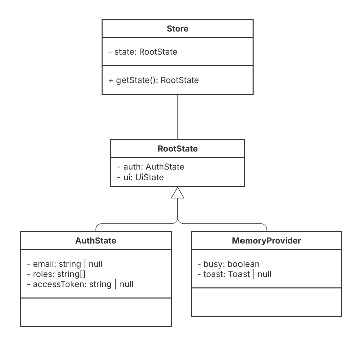
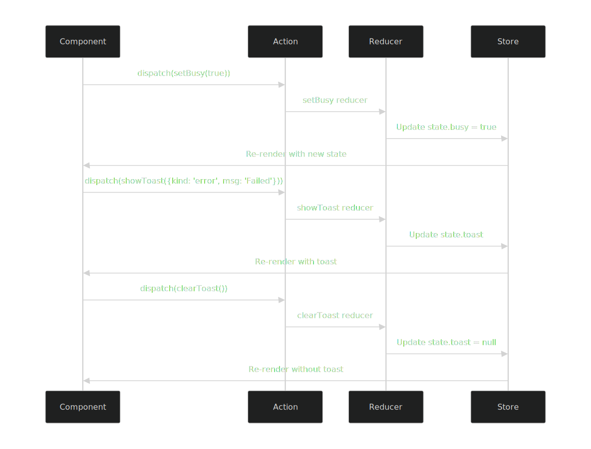

# 20MinCoach
Diseño de Software / IC-6821
  
## Group Members:
- Daniel Pulido
- Ian Porras
- Carlos Ávalos

# Project Architecture Documentation

## 0. Executive Summary

This repository contains the front-end architecture design, PoCs and implementation documentation for the 20MinCoach project. Here is a summarized list of the components used for this design:

- **Auth (PoC):** Uses `Supabase` (OTP email) + `TOTP MFA` flows integrated with expo. Supabase is Expo-friendly; replaces Auth0 MFA without the need for custom native configurations, satisfying the authentication requirements for this project.
- **Roles:** From `raw_app_meta_data.roles` 2 roles were defined: BasicUser, PremiumUser.
  - **Action A:** ("Start 20-min request") Basic & Premium.
  - **Action B:** ("View earnings") Premium only. 
- **UI Security:** RequireAuth, RequireRole and RoleGate (component/action-level gates) Dashboards use these guards.
- **HTTP Interceptor:** Injects bearer token; on 401 → sign-out, clear Redux, redirect `/auth`. "Force 401" button added to both dashboards for verification.
- **State & Data plumbing:**
  - **Redux Toolkit:** Slice auth ({email, roles}).
  - **TanStack Query provider:** Retries, cache, refetch on focus.
  - **httpJson helper:** timeout + safe JSON parse (layered on the interceptor).
- **Verification Page:** tools/data-test (inputs in blue for dark mode), uses TanStack Query + httpJson.

## 1. Technology Choices
- **Framework/Navigation:** `React Native`, `Expo`, `expo-router`
  - **React Native:** Enables a single codebase for iOS and Android, providing great cross-platform efficiency.
  - **Expo:** Expo provides an all-in-one environment with minimal native setup, as well as over-the-air updates and easy builds with EAS.
  - **expo-router:**  Simplifies navigation by mapping files to routes automatically, improving maintainability.
  - **Expo Go:** Allows fast testing without the need for custom native modules.
- **Authentication:** `Supabase` (`@supabase/supabase-js`) with `Email OTP` + `TOTP MFA`, secure storage via `expo-secure-store`  
  - **Supabase:** Provides hosted auth and database, reducing backend complexity. Provides an extra security layer to protect user accounts by using TOTP MFA. Enables modern, passwordless login; email OTP steamlines onboarding and improves UX.
  - `@supabase/supabase-js`: JS SDK that works seamlessly in React Native and Expo environments.
  - `expo-secure-store`:  Ensures tokens and secrets are stored encrypted on the device.
- **State Management:** `Redux Toolkit` (global app state), `TanStack Query` (remote server data)
  - **Redux Toolkit:** Holds app logic and provides centralized management for authentication, navigation guards and UI flags. Simplifies setup and enforces best practices.
  - **TanStack Query:** Manages network data, handles caching, retries, background refetching, and synchronization with server state.
- **Networking:** Native `fetch` wrapped by `withAuth` interceptor + `httpJson` utility. 
  - `withAuth`: Adds auth headers and handles token refresh logic in one place.
  - `httpJson`: Adds timeouts and automatic JSON parsing to reduce repetitive code.
 This provides a consistent API layer that ensures all network calls follow the same structure and error handling. Also keeps dependencies minimal while adding key functionality (auth, parsing, retries).
- **Middleware & Security in UI:** Custom guards and interceptors in `/src/middleware`. This will keep UI components clean by abstracting access control and network handling. 
  - `auth.guard.ts`: To ensure only authorized users with correct roles can access certain screens. This will check user roles and redirect unauthorized users.
  - `http.interceptor.ts`: Injects tokens into outgoing requests and handles 401 Unauthorized responses gracefully.
- **Prototype with AI + UX Testing:** `Lovable`, integrated with `Maze`
  - `Lovable`: Generates prototype screens consistent with UI components.
  - `Maze`: Allows for UX validation before implementation. Refine UI/UX based on real user interactions.
- **Services, Listeners & Simulations:** Mock simulations, `SSE` (EventSource), `expo-notifications`, `Daily Prebuilt` via `react-native-view`, `/src/services/realtime.ts`
  - `Daily Prebuilt`: Simulated sessions with basic controls using mock URL.
  - `SSE` & `setInterval`: Mocks to emit events (coach availability, acceptance).
  - `/src/services/realtime.ts`: exposes `subscribePresence()` and `subscribeSession()` for consuming events.
  - `expo-notifications`: Registers the device and displays local pushes based on simulations.
- **Business Models & Validation:** `/src/models`, `DTOs`, `Zod` schemas
  - `/src/models`: Define entities that will be used by the application.
  - `/src/services/dto.ts`: Maps API responses to internal models for data transformations.
  - `Zod`: Ensures data integrity with schemas and helps generate validators for new entities.
- **Error Handling & Logging:** `/src/middleware/error.middleware.ts`, `/src/utils/logger.ts`
  - `/src/utils/logger.ts`: Implements **Strategy Pattern** to switch between console output and future remote logging. All layers (services, UI, middleware) use the logger to ensure consistent debugger and traceability. Provides a single point of control for log formatting.
  - `/src/middleware/error.middleware.ts`: Maps API and logic errors to user-friendly UI messages, provides a single point of control for error formatting.
- **Styling:** React Native primitives with custom color scheme (blue inputs/text for dark mode). This avoids extra dependencies, while allowing for high-contrast colors to ensure readability and compliance with accessibility standards. Provides a centralized color palette that promotes uniform design across components.
- **Testing:** `Jest` + `React Testing Library`
  - `Jest`: Provides fats, isolated tests for logic and components. Integrates well with Expo-managed projects.
  - `React Testing Library`: Testing from user's perspective.
Automated tests will catch regressions early in CI/CD.

## 2. N-Layer Architecture Design

### 2.1. **Presentation Layer** `/app/coach`, `/app/(tabs)`, `/app/auth`, `/app/dashboard`
Render UI elements and handle user interactions.
  - Present data to users
  - Capture user input
  - Manage component state and lifecycle
  - Implement accessibility standards
  - Ensure responsive design compliance
  - Compose reusable UI components
---
### 2.2. **Controller Layer** 
Mediate between UI and business logic
  - Handle user input validation
  - Coordinate business service calls
  - Manage side effects
  - Transform data for presentation
  - Provide hook-based connectors to components
  - Implement dependency injection for services
---
### 2.3. **Model Layer** (`/src/models`)
Define data structures and validation rules
  - Define entity interfaces and classes
  - Implement data validation logic
  - Maintain data integrity rules
  - Provide type definitions
  - Handle data serialization/deserialization

  **Key Files**:
  - `BaseModel.ts` - Abstract base class for all models
  - `User.ts`, `Coach.ts`, `SessionRequest.ts`, `Earning.ts` - Domain models
  - `index.ts` - Barrel exports
---
### 2.4. **Middleware Layer** (`/src/middleware`)
Intercept and process requests/responses
  - Handle HTTP request/response interception
  - Manage authentication tokens
  - Implement cross-cutting concerns
  - Process errors before they reach components
  - Validate permissions for routes
  - Error transformation for UI
  - Logging integration

  **Key Files**:
  - `auth.guard.tsx` - Authentication middleware
  - `http.interceptor.ts` - HTTP interceptor middleware

  #### Auth Guard

  Use `RequireAuth` and `RequireRole` functions from `/src/middleware/auth.guard.tsx` in the UI components to add verifications for protected routes. See `/app/dashboard/basic.tsx` for an example implementation of this function. To add different role guards you will need to modify the constant `can`, and add the different actions and the roles approved for said actions and the method `RoleGuard` to add the new actions and the validations (both of these are found in `/src/middleware/auth.guard.tsx`).

  ##### Dependency Graph
```
supabase.auth
    ↑
http.interceptor (withAuth, setOnUnauthorized)
    ↑
auth.guard (can, RequireAuth, RequireRole, RoleGate)
    ↑
App Components
    ├── Protected Routes (use RequireAuth)
    ├── Role-based Routes (use RequireRole) 
    └── Conditional UI (use RoleGate)
```
  
  ##### Route Protection Diagram

  The general logic for visiting protected routes is presented in the following diagram:

  

  #### HTTP Interceptor

  Use the `withAuth` function from `/src/middleware/http.interceptor.ts` to add authorization headers to the API calls. This method is already implemented in `/src/services/http.ts`, add this method to new services that require API authentication.
  

---
### 2.5. **Business Layer**
Implement core business logic and rules
  - Enforce business rules and validation
  - Coordinate domain operations
  - Manage business workflows
  - Implement domain-driven design patterns
  - Handle complex business transactions
---
### 2.6. **Proxy/Client/Services Layer**
Communicate with external services and APIs
  - Abstract API communication details
  - Handle HTTP requests/responses
  - Manage service endpoints
  - Implement retry mechanisms
  - Handle service 
--- 
### 2.7. **Background/Jobs/Listeners Layer**
Manage asynchronous operations and real-time updates
  - Handle periodic data refresh
  - Manage real-time event listeners
  - Process background tasks
  - Implement pub/sub patterns
  - Coordinate WebSocket connections
---
### 2.8. **Validators Layer**(`/src/validators`)
Validate data integrity and business rules
  - Validate user input data
  - Enforce data format rules
  - Provide validation error messages
  - Implement cross-field validation
  - Reuse validation logic across layers

  Validators must be used whenever API data is received, it uses the DTOs and other validations to make sure the data was received as expected. See `/src/validators/coach.validator.ts` for the implementation of the validators. Follow the example in `/src/mappers/coach.mapper.ts` to use the validateCoachDTO function. All validation logic should be implemented here, it can be different regex to check for names in correct formatting, remove duplicates in arrays, etc.

---
### 2.9. **DTOs Layer** (`/src/dto`)
Transform data between external and internal formats
  - Define data transfer object interfaces
  - Transform API responses to internal models
  - Handle data normalization
  - Manage version compatibility
  - Isolate external API changes

  The DTOs should be used when sending/receiving data from backend APIs. This is important to maintain frontend models with changing APIs.
```
// API calls
GET /api/coaches
POST /api/coaches
PUT /api/coaches/{id}

// Data mapping between layers
API Request → API Service → DTO Transformation → Validation → Model → Component
```

FrontEnd mappers implement DTO classes to access API data. See `/src/dto/coach.dto.ts` for the implementation of the coach DTO. Follow the example in `/src/mappers/coach.mapper.ts` to use the CoachDTO interface.

#### Example

---
### 2.10. **State Management Layer** (`/src/store`)
Manage application-wide state
  - Store and retrieve global state
  - Handle state persistence
  - Manage state transitions
  - Coordinate component state sharing
  - Implement state 

  Redux manages single source of truth for the app state

  

  

  

--- 
### 2.11. **Styles Layer** (`/src/`)
Manage visual presentation and theming
  - Define design system and themes
  - Implement responsive breakpoints
  - Manage CSS-in-JS or styled components
  - Handle dark/light mode switching
  - Ensure visual consistency
---
### 2.12. **Utilities Layer** (`/src/utils`)
Provide reusable helper functions and services
  - Implement common utility functions
  - Provide date/number formatting
  - Handle common transformations
  - Implement singleton services
  - Share reusable logic across application
---
### 2.13. **Exception Handling Layer** (`/src/utils/error`)
Manage error handling and user feedback
  - Catch and process errors
  - Transform technical errors to user-friendly messages
  - Implement error recovery strategies
  - Log errors appropriately
  - Provide consistent error handling patterns

  

```
  Type System Hierarchy
BaseError (abstract)
├── ApiError → { statusCode, url }
├── ValidationError → { fieldErrors }
├── NetworkError → { }
└── BusinessError → { }

UIError (interface)
├── code: string
├── message: string  
├── originalError?: string
├── fieldErrors?: object
└── retryable: boolean

ErrorFactory (static)
└── fromUnknown(error): BaseError
```


#### Strategies

##### ApiError Strategy
This should add a status code referring to the status of the API call and the url of the API being used. Override `toUI()` method to add the different user friendly messages for the known error codes. Retryable is based on the status code received.
##### ValidationError Strategy
This should add the object where the field errors presented. Override `toUI()` method to handle the error message, highlight UI Component that presented the first error, etc. Should not be retryable.
##### NetworkError Strategy
Override `toUI()` method to add network message, add retry button. Should always be retryable.
##### BusinessError Strategy
Override `toUI()` method to add messages for known business errors, add default message for unkown errors. Can be retryable.

Client code should be calling `error.toUI()` method, depending on the strategy the different error handling variations will act in order to show user friendly messages, set retryable, etc.


#### Application Error Flow
Application Error Flow
```
┌─────────────────┐    ┌──────────────────┐    ┌─────────────────┐
│  Client Layer   │    │  Error Factory   │    │    UI Layer     │
├─────────────────┤    ├──────────────────┤    ├─────────────────┤
│ HTTP Request    │───>│ fromUnknown()    │───>│ error.toUI()    │
│ fails with      │    │ converts to      │    │ transforms to   │
│ status 500      │    │ typed error      │    │ user-friendly   │
│                 │    │                  │    │ message         │
│ Validation      │───>│                  │───>│                 │
│ fails           │    │                  │    │ shows field     │
│                 │    │                  │    │ errors          │
│ Network         │───>│                  │───>│ shows retry     │
│ timeout         │    │                  │    │ button          │
└─────────────────┘    └──────────────────┘    └─────────────────┘
```
---
### 2.14. **Logging Layer** (`/src/utils/logger`)
Handle application logging and monitoring
  - Record application events and errors
  - Implement structured logging
  - Support multiple log providers
  - Manage log levels and filtering
  - Provide audit trails


```
src/utils/logger.ts
├── Types & Interfaces
│   ├── LogLevel = 'info' | 'warn' | 'error'
│   └── LogProvider (interface)
│       └── log(level, message, ctx?)
│
├── Concrete Strategies
│   ├── ConsoleProvider (implements LogProvider)
│   │   └── log() → console methods
│   └── MemoryProvider (implements LogProvider)
│       ├── records: Array
│       ├── log() → store in memory
│       └── clear() → clear records
│
└── Context
    └── Logger
        ├── provider: LogProvider
        ├── constructor(provider?)
        ├── setProvider(provider)
        ├── info(message, ctx?)
        ├── warn(message, ctx?)
        └── error(message, ctx?)
```


#### Strategies

##### ConsoleProvider Strategy
Override `log()` method to add the logging for the console and manage different loggin levels.
##### MemoryProvider Strategy
Use records Array to store records on memory. Override `log()` method to push logs into the array.
##### LogProvider Strategy
Override `log()` method to add the logging for base loggin.
##### FutureProvider Strategy
Add different attributes needed for the new provider logic. Override `log()` method to add the logging logic for the provider implemented.

Client code should be calling the logger and use the different methods for the log type. Logger will call the selected strategy.


#### Application Logging Flow

```
┌──────────────────┐    ┌──────────────────┐    ┌──────────────────┐    ┌──────────────────┐
│  Application     │    │   Logger         │    │  LogProvider     │    │  Destination     │
│    Code          │    │   Facade         │    │  Interface       │    │                  │
├──────────────────┤    ├──────────────────┤    ├──────────────────┤    ├──────────────────┤
│ Service calls    │───>│ info()           │───>│ log()            │───>│ Console          │
│ logger.info()    │    │                  │    │                  │    │                  │
│                  │    │                  │    │                  │    │ writes to        │
│ API layer logs   │───>│ warn()           │───>│                  │───>│ browser/devtools │
│ errors           │    │                  │    │                  │    │                  │
│                  │    │                  │    │                  │    │ Memory           │
│ Test code uses   │───>│ error()          │───>│                  │───>│                  │
│ memory provider  │    │                  │    │                  │    │ stores in array  │
│                  │    │ setProvider()    │    │                  │    │                  │
│ Production swaps │───>│ swaps strategy   │───>│                  │───>│ File             │
│ to file logging  │    │ at runtime       │    │                  │    │                  │
│                  │    │                  │    │                  │    │ writes to disk   │
└──────────────────┘    └──────────────────┘    └──────────────────┘    └──────────────────┘
```

---
### 2.15. **Security Layer** (`/src/api/supabase.ts`, `/src/auth/mfa.ts`, `/src/auth/session.ts`, `/src/auth/supabaseAuth.ts`)
Manage authentication and authorization
  - Handle user authentication
  - Manage authorization rules
  - Secure data storage
  - Implement security best practices
  - Protect against common vulnerabilities

#### Security Layer Architecture
```
┌─────────────────────────────────────────────────────────────┐
│                  SECURITY LAYER                             │
├─────────────────────────────────────────────────────────────┤
│                                                             │
│  ┌─────────────────┐  ┌─────────────────┐  ┌──────────────┐ │
│  │  AUTHENTICATION │  │  AUTHORIZATION  │  │ DATA SECURITY│ │
│  │                 │  │                 │  │              │ │
│  │ • User Login    │  │ • Access Rules  │  │ • Encryption │ │
│  │ • Session Mgmt  │  │ • Role Checks   │  │ • Secure     │ │
│  │ • MFA Flows     │  │ • Permissions   │  │   Storage    │ │
│  │ • Token Refresh │  │ • Policy        │  │ • Validation │ │
│  └─────────────────┘  └─────────────────┘  └──────────────┘ │
│                                                             │
└─────────────────────────────────────────────────────────────┘
         │               │               │               │
         ▼               ▼               ▼               ▼
┌───────────────┬───────────────┬───────────────┬───────────────┐
│ /src/api/     │ /src/auth/    │ /src/auth/    │ /src/auth/    │
│ supabase.ts   │ mfa.ts        │ session.ts    │ supabaseAuth.ts│
└───────────────┴───────────────┴───────────────┴───────────────┘
```

#### Detailed File Structure & Responsibilities

```
supabase.ts
├── Client Configuration
│   ├── SUPABASE_URL from expo-constants
│   ├── SUPABASE_ANON_KEY from expo-constants
│   └── PKCE flow for Expo Go
├── Secure Storage Layer
│   ├── Expo SecureStore integration
│   ├── Token persistence
│   └── Auto-refresh tokens
├── Auth Session Setup
│   ├── Redirect URI configuration
│   └── Proxy setup for Expo Go
└── Security Features
    ├── Session detection in URLs
    ├── Auto token refresh
    └── Secure token storage
```
```
mfa.ts
├── TOTP Enrollment
│   ├── Factor enrollment
│   └── Secret generation
├── Verification Flows
│   ├── Challenge and verify
│   └── 6-digit code validation
└── Factor Management
    ├── List enrolled factors
    └── TOTP-specific operations
```
```
session.ts
├── Session Management
│   ├── Get current session
│   └── Access token retrieval
├── Role-Based Authorization
│   ├── Extract roles from app_metadata
│   ├── Fallback to raw_app_meta_data
│   └── Default to empty array
└── User Context
    ├── Email extraction
    └── Authentication snapshot
```
```
supabaseAuth.ts
├── Password Authentication
│   ├── Sign up with email/password
│   ├── Sign in with email/password
│   └── Error handling
├── Password Management
│   ├── Set/update password
│   ├── Password reset flow
│   └── Email redirect configuration
├── Session Operations
│   ├── Sign out
│   ├── Get current session
│   └── Get user info
└── Recovery Flows
    └── Password reset email
```


---
### 2.16. Linter Configuration Layer (eslint.config.js) 

Purpose: Enforce code quality & consistency across TypeScript / React-Native / Expo.

Files

Linter rules → eslint.config.js (flat config)

Formatter → .prettierrc

Key rules (highlights)

// eslint.config.js (excerpt)
rules: {
  // Custom rule: ban console.log in app code
  'no-console': ['error', { allow: ['warn', 'error'] }],

  // Hygiene
  '@typescript-eslint/no-unused-vars': [
    'error', { argsIgnorePattern: '^_', varsIgnorePattern: '^_' }
  ],

  // Consistent import ordering & aliases
  'import/order': ['error', { /* internal aliases, newlines-between, alphabetize */ }],
},
overrides: [
  // Allow logs in tests only
  { files: ['**/*.test.{ts,tsx}'], rules: { 'no-console': 'off' } }
]


Code style

Prettier → single quotes, trailing commas, print width 100, semicolons (.prettierrc).

How to run

pnpm lint         # fails CI on any warning (--max-warnings=0)
pnpm lint:fix     # auto-fix where possible
pnpm format       # run Prettier over the repo

 
Rationale

Flat ESLint + TS + React + import-order + Prettier → consistent imports & style.

Aliased import resolution matches tsconfig paths.

Custom rule bans console.log in app code (tests exempted).

# 2.17. Build & Deployment Pipeline (EAS Build) 

Files

Build profiles → eas.json

App settings → app.json

CI pipeline → .github/workflows/lint-and-test.yml

Env template → .env.example

Profiles (summary)

Profile	Distribution	APP_ENV	Use case
development	internal	development	Dev client (replaces Expo Go; native APIs)
preview	internal	staging	QA / stakeholder previews
production	store	production	Store-ready builds

Common commands

# Auth once
eas login

# Build
eas build -p android --profile development
eas build -p ios     --profile development
eas build -p android --profile preview
eas build -p ios     --profile preview
eas build -p android --profile production
eas build -p ios     --profile production

# Submit (signed)
eas submit -p android --profile production
eas submit -p ios     --profile production


CI (overview)

On each PR, CI runs: pnpm i --frozen-lockfile, pnpm lint, pnpm test:ci.

See: .github/workflows/lint-and-test.yml.

Why this meets the requirement

Env-specific builds via eas.json + APP_ENV.

Smaller/faster prod bundles (Hermes/Expo defaults; production profile).

Deterministic installs (--frozen-lockfile) + tests & lint enforced in CI.

Clear developer instructions (run, build, submit) in README; full configs live in their files.
---


## 3. Visual Components Strategy

### Overview
*Note: This section documents the proposed component architecture and testing strategy. None of these components or responsive designs have been implemented yet, but they represent the planned approach for the 20minCoach frontend.*

### 3.1 Component Organization Strategy

#### Atomic Design Structure
```
/src/components
├── /ui              # Basic UI elements (Button, Input, Text)
├── /coach           # Component combinations (CoachCard)
├── /layout          # Complex sections (Grid, ResponsiveContainer)
├── /templates       # Page layouts
└── /theme           # Design system
```

#### Development Principles
- **Single Responsibility**: Each component has one clear purpose
- **TypeScript Interfaces**: Strongly typed props for all components
- **Composition over Configuration**: Prefer children props over complex configs

### 3.2 Component Development Workflow

**Standardized component creation process:**

1. **Create component folder** under appropriate category (ui, coach, layout, etc.)
2. **Add component file** (`ComponentName.tsx`) with TypeScript interface:
```typescript
interface PrimaryButtonProps {
  title: string;
  onPress: () => void;
  disabled?: boolean;
}
```
3. **Implement UI** using React Native primitives and theme constants
4. **Export component** from central `index.ts` for easier imports

### 3.3 Accessibility Standards

#### Required Props
All interactive components must include:
```typescript
interface AccessibleProps {
  accessibilityLabel: string;
  accessibilityHint?: string;
  accessibilityRole: AccessibilityRole;
  accessible: boolean;
}
```

#### Screen Reader Support
- Images have descriptive `accessibilityLabel`
- Form fields include labels and hints
- Proper roles for all interactive elements
- Dynamic content announces changes

### 3.4 Responsive Design

#### Planned Hook
```typescript
// hooks/useResponsive.ts (Not implemented)
const useResponsive = () => {
  // Would provide breakpoints and responsive values
  // Small (375px), Medium (414px), Large (768px)
};
```

#### Responsive Values
Components would adapt to:
- **Small**: iPhone SE and smaller devices
- **Medium**: Standard smartphones  
- **Large**: Tablets and larger screens

### 3.5 Component Testing Methodology

#### Testing Levels
1. **Unit Tests**: Individual component behavior
2. **Integration Tests**: Component interactions
3. **Accessibility Tests**: Screen reader compatibility

#### Testing Approach
```typescript
// Example test pattern (Not implemented)
import { render, fireEvent } from '@testing-library/react-native';

test('calls onPress when pressed', () => {
  const onPressMock = jest.fn();
  const { getByText } = render(<PrimaryButton title="Click Me" onPress={onPressMock} />);
  fireEvent.press(getByText('Click Me'));
  expect(onPressMock).toHaveBeenCalled();
});
```

#### Test Utilities
- React Testing Library for user-centric testing
- Custom render with all providers
- Accessibility compliance checks

### 3.6 Theme Support

#### Planned Implementation
- Dark/Light mode switching capability
- Centralized color palette
- Consistent spacing and typography

### 3.7 Quality Gates

#### Pre-Merge Requirements
- All tests passing
- TypeScript compilation successful
- Accessibility audit passed
- Design system compliance

*Note: This represents the intended architecture. Actual implementation would follow these guidelines during development.*

---

## Directory Structure
```
src
├── /models # Business domain models
├── /services # Business logic and API layer
├── /validators # Data validation schemas
├── /utils # Utilities (logging, errors)
├── /middleware # Error handling middleware
├── /hooks # Custom React hooks
├── /components # UI components
├── /navigation # App navigation
└── /test-utils # Testing utilities
```

## 2. How-to Guides

```markdown
### How to Add a New Service

### Step 1: Create the Service File

Create a new file in `/src/services/`:

```typescript
// /src/services/notificationService.ts

import { apiService } from './api';
import { DTOTransformer } from './dto';
import { logger } from '../utils/logger';
import { BusinessError } from '../utils/errors';

export interface Notification {
  id: string;
  title: string;
  message: string;
  type: 'INFO' | 'WARNING' | 'ERROR';
  read: boolean;
  createdAt: Date;
}

class NotificationService {
  async getUserNotifications(userId: string): Promise<Notification[]> {
    try {
      logger.info('Fetching user notifications', { userId });
      
      const response = await apiService.get(`/users/${userId}/notifications`);
      
      // Transform API response to models
      return response.map((notification: any) => ({
        id: notification.id,
        title: notification.title,
        message: notification.message,
        type: notification.type,
        read: notification.is_read,
        createdAt: new Date(notification.created_at),
      }));
    } catch (error) {
      logger.error('Failed to fetch notifications', error as Error, { userId });
      throw new BusinessError(
        'NOTIFICATIONS_FETCH_FAILED',
        'Failed to load notifications'
      );
    }
  }

  async markAsRead(notificationId: string): Promise<void> {
    try {
      await apiService.patch(`/notifications/${notificationId}`, {
        read: true,
      });
      logger.debug('Notification marked as read', { notificationId });
    } catch (error) {
      logger.error('Failed to mark notification as read', error as Error, { notificationId });
      throw new BusinessError(
        'NOTIFICATION_UPDATE_FAILED',
        'Failed to update notification'
      );
    }
  }
}

export const notificationService = new NotificationService();
```

---

# UX Testing Documentation

## Prototype & Usability Testing

### AI Prototype
- **Tool**: Lovable AI
- **Purpose**: Generate interactive prototype for user testing
- **Live Prototype**: [\[PROTOTYPE LINK\]](https://vocal-guru.lovable.app/)

### Usability Studies
- **Platform**: Maze
- **Studies**: 2 live studies with 3-5 participants each

#### Study 1: "Search a fitness coach and open profile"
- **Tests**: User's ability to find and view coach profiles
- **Metrics**: Completion rate, time on task, click paths
- **Results**: `/docs/ux/maze-study-results/study-1-metrics.pdf`

#### Study 2: "Accept the suggested coach (Start 20-min request)"
- **Tests**: User's ability to book a coaching session  
- **Metrics**: Completion rate, difficulty rating, user feedback
- **Results**: `/docs/ux/maze-study-results/study-2-heatmaps.png`

### Evidence & Reports
- **UX Test Report**: `/docs/ux/ux-test-report.md`
- **Participant Feedback**: `/docs/ux/maze-study-results/participant-feedback.md`
- **Improvements Backlog**: `/docs/ux/improvements-backlog.md`
- **Prototype Links**: `/docs/ux/prototype-links.txt`

# Referencia para N-Layer Architecture

### 1. Presentation Layer (UI)
**Location:** `/src/components`, `/src/screens`, `/src/navigation`
- Displays data and collects user input.
- No business logic; delegates to state or services.
- Example: `CoachListScreen.tsx` calls `useCoachesQuery()` and renders list.

---

### 2. State Management Layer
**Location:** `/src/store`, `/src/hooks`, `/src/query`
- Manages global state (Redux Toolkit) and remote data (TanStack Query).
- Provides custom hooks for UI consumption.
- Example: `authSlice.ts`, `useCoachesQuery()`.

---

### 3. Domain Layer (Business Models)
**Location:** `/src/models`
- Pure business entities and rules: `User`, `Coach`, `Session`, `Role`.
- No networking, no middleware.
- Example: `Coach` class with domain logic (e.g., eligibility checks).

---

### 4. Validation & Transformation Layer
**Location:** `/src/validators`, `/src/services/dto.ts`
- DTOs: transform API responses to domain models and vice versa.
- Validators (Zod schemas) ensure correct data before entering domain layer.
- Example: `CoachSchema` validates incoming data; `dto.ts` maps `{ first_name } → { firstName }`.

---

### 5. Service / Application Layer
**Location:** `/src/services`
- Orchestrates domain models and infrastructure (API/networking) for the UI.
- Contains business workflows.
- Example:
  - `coachService.ts`: calls HTTP, applies DTOs, returns domain objects.
  - Can use **service-specific middleware** like `auth.guard.ts` to enforce rules at service boundaries.

---

### 6. Infrastructure Layer
**Location:** `/src/utils`, `/src/config`, `/src/middleware`, `/src/lib`
- Technical support (purely non-business): HTTP wrappers, logging, storage, error handling.
- Middleware like `http.interceptor.ts` lives here because it’s **technical, not business**.
- Example:
  - `httpJson.ts`: fetch wrapper with timeout and JSON parsing.
  - `logger.ts`: Strategy pattern logging.
  - `error.middleware.ts`: maps errors to messages.

---

### 7. Cross-Cutting Concerns
- **Logging:** via `logger.ts`
- **Error Handling:** via `error.middleware.ts`
- **Security:** route guards (`auth.guard.ts` in services layer), token storage.
- **Configuration:** environment variables and constants in `/src/config`.

---
